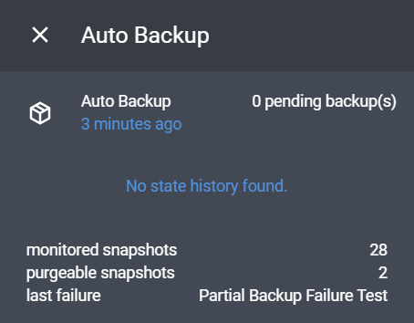

# <span style="font-family: 'Segoe UI Emoji'">🗃</span> Auto Backup

[](https://github.com/custom-components/hacs)
[](https://my.home-assistant.io/redirect/config_flow_start/?domain=auto_backup)

Improved Backup Service for Home Assistant that can Automatically Remove Backups and Supports Generational Backup Schemes.
**Note: Requires the Home Assistant [Supervisor](https://www.home-assistant.io/installation) to Create Backups.**

While Home Assistant does provide built-in services for creating backups, these are not documented and do not provide a way to automatically remove them, this custom component aims to fix that.

## Services

All service parameters are optional.

### `auto_backup.backup_full`

Create a full backup with optional exclusions.

| Parameter                         | Description                                         | Type                                | Example                                                                                          |
| --------------------------------- | --------------------------------------------------- | ----------------------------------- | ------------------------------------------------------------------------------------------------ |
| `name`                            | Backup name.                                        | `string`                            | Automatic Backup {{ now().strftime('%Y-%m-%d') }}                                                |
| `password`                        | Optional password to secure backup.                 | `string`                            | 1234                                                                                             |
| [`keep_days`](#keep-days)         | The number of days to keep the backup.              | `float`                             | 2                                                                                                |
| `exclude`                         | Addons/Folders to exclude from the backup.          | [`exclude_object`](#exclude-object) | [`{"addons": ["MariaDB"], "folders": ["Local add-ons", "share"]}`](#example-exclude-from-backup) |
| [`download_path`](#download-path) | Directory to download the backup to after creation. | `directory`                         | /usb_drive                                                                                       |

#### Exclude Object

| Parameter                       | Description                              | Type   | Example                                     |
| ------------------------------- | ---------------------------------------- | ------ | ------------------------------------------- |
| [`addons`](#addonfolder-names)  | List of addons to backup (name or slug). | `list` | ["Almond", "glances", "core_mariadb"]       |
| [`folders`](#addonfolder-names) | List of folders to backup.               | `list` | ["Local add-ons", "homeassistant", "share"] |

---

### `auto_backup.backup_partial`

Create a partial backup.

| Parameter                         | Description                                         | Type        | Example                                           |
| --------------------------------- | --------------------------------------------------- | ----------- | ------------------------------------------------- |
| `name`                            | Backup name.                                        | `string`    | Automatic Backup {{ now().strftime('%Y-%m-%d') }} |
| [`addons`](#addonfolder-names)    | List of addons to backup (name or slug).            | `list`      | ["Almond", "glances", "core_mariadb"]             |
| [`folders`](#addonfolder-names)   | List of folders to backup.                          | `list`      | ["Local add-ons", "homeassistant", "share"]       |
| `password`                        | Optional password to secure backup.                 | `string`    | 1234                                              |
| [`keep_days`](#keep-days)         | The number of days to keep the backup.              | `float`     | 2                                                 |
| [`download_path`](#download-path) | Directory to download the backup to after creation. | `directory` | /usb_drive                                        |

---

### `auto_backup.purge`

Purge expired backups.

There are no parameters here, just call the service, and it will remove any expired backups.

This service is useful if you want to manually specify when to purge backups,
such as doing a batch delete at 12AM (_Note: expired backups are automatically purged when creating new backups,
this can be disabled in the [config](#configuration)_).

## Addon/Folder Names

**Addon names** are case-insensitive and can be the addon name/title, these are the same names seen when creating a partial backup through the Supervisor backups page. They can also be the addons slug (slug must be lowercase).

**Folder names** are also case-insensitive and use the names seen when creating a partial backup through the Supervisor backups page.
Currently, accepted values are (ignoring case):

- `ssl`
- `share`
- `media`
- `local add-ons` or `addons/local`
- `home assistant configuration` or `homeassistant`

## Keep Days

The `keep_days` parameter allows you to specify how long the backup should be kept for before being deleted. Default is forever. You can specify a float value for keep days, e.g. to keep a backup for 12 hours use `0.5`.

## Download Path

The `download_path` parameter allows you to specify a directory to download the backup to after creation. This directory must be accessible from Home Assistant. If you are running in docker your paths will be relative to the container for example your Home Assistant configuration directory is stored under `/config` and the share folder is under `/share`.

The backup will still be stored under `/backup` and show up on the Supervisor backups page, _it will only be downloaded to the location specified_, to immediately delete the backup from the Supervisor use a negative value for `keep_days` (-1 will suffice).

A slugified version of the backups name will be used for the filename, if a file with that name already exists the backups slug will be used instead.

> Note: on docker by default you and this integration do not have direct access to the `/backup` folder, which is why the backup is downloaded and not copied.

## Events

[Automation Example](#example-notify-on-backup-failure)

* Event: `auto_backup.backup_start`, data: `{"name": "NAME"}`
* Event: `auto_backup.backup_successful`, data: `{"name": "NAME", "slug": "SLUG"}`
* Event: `auto_backup.backup_failed`, data: `{"name": "NAME", "error": "ERROR"}`
* Event: `auto_backup.purged_backups`, data: `{"backups": ["SLUG"]}`

## Sensor



## Configuration

After installing Auto Backup via HACS, it can then be setup via the UI, go to the Integrations menu and add `Auto Backup`.

On Home Assistant 2021.3.0 and above you can use the badge below to automatically start the setup

[](https://my.home-assistant.io/redirect/config_flow_start/?domain=auto_backup)

<details>
<summary>Manual Configuration (Deprecated)</summary>
<br>

Just add `auto_backup` to your home assistant configuration.yaml file.

> ```yaml
> # Example configuration.yaml entry
> auto_backup:
>   auto_purge: true
> ```

### Configuration Variables

- **auto_purge** _(boolean) (Optional)_
  - _Default value:_ `true`
  - This option will automatically purge any expired backups when creating a new backup.

- **backup_timeout** _(integer) (seconds) (Optional)_
  - _Default value:_ `1200` (20 min)
  - You can increase this value if you get timeout errors when creating a backup. This can happen with very large backups.

</details>

## Examples

### Example: Notify on Backup Failure

> ```yaml
> - alias: "Notify Backup Failure"
>   trigger:
>     platform: event
>     event_type: auto_backup.backup_failed
>   action:
>     service: persistent_notification.create
>     data:
>       title: "Backup Failed."
>       message: "Name: {{ trigger.event.data.name }}\nError: {{ trigger.event.data.error }}"
> ```

### Example: Automatic Backups

Perform a partial backup of the home assistant config folder, mariadb and mosquitto every 3 hours,
and store each backup for 2 days.

> ```yaml
> - alias: Perform Auto Backup
>   trigger:
>     - platform: time_pattern
>       hours: "/3"
>   action:
>     - service: auto_backup.backup_partial
>       data:
>         name: "AutoBackup: {{ now().strftime('%a, %-I:%M %p (%d/%m/%Y)') }}"
>         addons:
>           - almond
>           - Glances
>           - mosquitto broker
>           - core_mariadb
>         folders:
>           - homeassistant
>           - Share
>           - ssl
>           - Local add-ons
>         keep_days: 2
> ```

### Example: Exclude from Backup

> ```yaml
> - alias: Perform Daily Backup
>   trigger:
>     - platform: time
>       at: "00:00:00"
>   action:
>     - service: auto_backup.backup_full
>       data:
>         name: "DailyBackup: {{ now().strftime('%A, %B %-d, %Y') }}"
>         keep_days: 7
>         exclude:
>           addons:
>             - Portainer
>           folders:
>             - Local add-ons
>             - share
> ```

---

## Advanced Example: Generational Backups

### Preface

Generational backups [(wiki)](https://en.wikipedia.org/wiki/Backup_rotation_scheme#Grandfather-father-son) allow you to store backups over a long period of time while still having frequent enough backups to be useful for recovery. This is done by reducing the frequency of backups as they get older. <br>
_Personally I take a backup of home assistant every 3 hours for the first 2 days, then each day for a week, and finally each week for a month._

For example, lets say my database has corrupted and I want to restore it.

If it's been less than 48 hours since it corrupted then I can restore to the exact point before it corrupted +/- 1.5 hours (if you're monitoring trends you don't want to lose hours worth of data, so 1.5 is pretty good),

If 48 hours have passed then I can restore to any point +/- 12 hours over the past 5 days (minus the two where the db was corrupted).

Over a week I can restore to any point +/- 1 week over the past 3 weeks, while +/- 1 week isn't very useful for restoring a database, it can be useful for subtle thing you don't notice, like if you accidentally deleted something.

This is substantially more efficient than storing a backup every 3 hours for a month, and while you lose some accuracy as the backups get older, most failures (if they even occur) will be noticed within 48 hours,

Also, most things other than your database don't change that often so a 4-week-old backup of your home assistant config may be the same as 1 day old backup.
Also in my case the 3 hourly backup only backs up the important files to save on storage, whereas my daily/weekly backups are full backups.

Of course, you can tweak these values to your liking, or even add a month/yearly backup schedule 👍.

### Automation

```yaml
automation:
  - alias: Perform Auto Backup
    trigger:
      platform: time_pattern # Perform backup every 3 hours.
      hours: "/3"
    action:
      service: auto_backup.backup_partial # Only perform a partial backup to save storage.
      data:
        name: "AutoBackup: {{ now().strftime('%a, %-I:%M %p (%d/%m/%Y)') }}"
        addons:
          - core_mariadb # It doesn't matter if you use the addon slug or name. Name is easier.
          - core_mosquitto
        folders:
          - homeassistant
          - share
          - ssl
        keep_days: 2

  - alias: Perform Daily Backup
    trigger:
      platform: time
      at: "02:30:00"
    condition:
      condition: time # Perform backup every day except Mondays.
      weekday:
        - tue
        - wed
        - thu
        - fri
        - sat
        - sun
    action:
      service: auto_backup.backup_full
      data:
        name: "DailyBackup: {{ now().strftime('%A, %B %-d, %Y') }}"
        keep_days: 7

  - alias: Perform Weekly Backup
    trigger:
      platform: time
      at: "02:30:00"
    condition:
      condition: time # On Mondays perform a weekly backup
      weekday:
        - mon
    action:
      service: auto_backup.backup_full
      data:
        name: "WeeklyBackup: {{ now().strftime('%A, %B %-d, %Y') }}"
        keep_days: 28 # Store backup for a month, basically perform 1 backup each week and store for 4 weeks.
```
