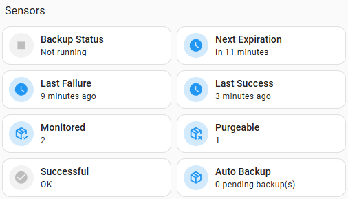
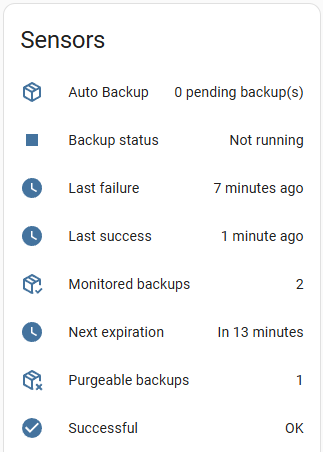

# Entities

Entities for monitoring and controlling the Auto Backup integration.

| Name              | Type            | Enabled by default | Description                                                                                                  |
| ----------------- | --------------- | ------------------ | ------------------------------------------------------------------------------------------------------------ |
| Purge             | `button`        | ✅                 | Purge expired backups ondemand, otherwise, they are purged automatically when creating a new backup          |
| Backup Status     | `binary_sensor` | ✅                 | Displays whether a backup operation is currently running                                                     |
| Successful        | `binary_sensor` |                    | Whether the last backup **succeeded** or **failed**                                                          |
| Last Failure      | `sensor`        | ✅                 | Time of the last **failed** backup                                                                           |
| Last Success      | `sensor`        | ✅                 | Time of the last **successful** backup                                                                       |
| Monitored backups | `sensor`        | ✅                 | How many backups have an expiry date and are being monitored to be purged.                                   |
| Purgeable backups | `sensor`        | ✅                 | The number of backups which have passed their expiry date and will be purged during the next purge operation |
| Next Expiration   | `sensor`        |                    | How long until the next non-expired backup will expire                                                       |

---

**Additional images**

